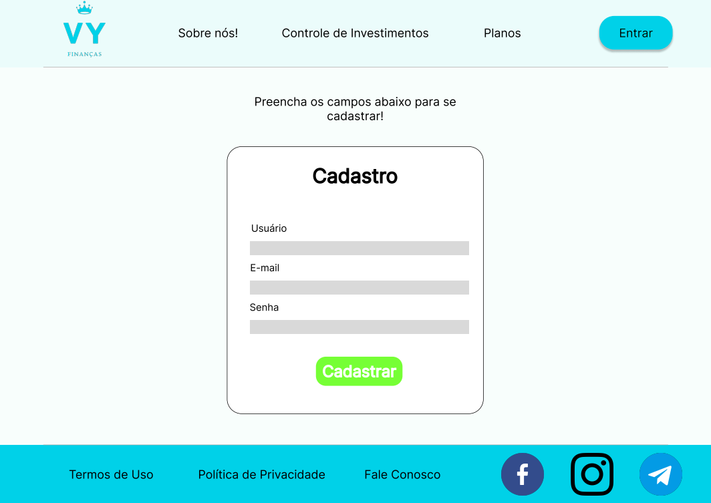

# Informações do Projeto
`TÍTULO DO PROJETO`  

VY Finanças

`CURSO` 

Ciência da Computação

## Participantes

Vinícius Miranda de Araújo e Yago Almeida

# Estrutura do Documento

- [Informações do Projeto](#informações-do-projeto)
  - [Participantes](#participantes)
- [Estrutura do Documento](#estrutura-do-documento)
- [Introdução](#introdução)
  - [Problema](#problema)
  - [Objetivos](#objetivos)
  - [Justificativa](#justificativa)
  - [Público-Alvo](#público-alvo)
- [Especificações do Projeto](#especificações-do-projeto)
  - [Personas, Empatia e Proposta de Valor](#personas-empatia-e-proposta-de-valor)
  - [Histórias de Usuários](#histórias-de-usuários)
  - [Requisitos](#requisitos)
    - [Requisitos Funcionais](#requisitos-funcionais)
    - [Requisitos não Funcionais](#requisitos-não-funcionais)
  - [Restrições](#restrições)
- [Projeto de Interface](#projeto-de-interface)
  - [User Flow](#user-flow)
  - [Wireframes](#wireframes)
- [Metodologia](#metodologia)
  - [Divisão de Papéis](#divisão-de-papéis)
  - [Ferramentas](#ferramentas)
  - [Controle de Versão](#controle-de-versão)
- [Projeto da Solução](#projeto-da-solução)
  - [Tecnologias Utilizadas](#tecnologias-utilizadas)
  - [Arquitetura da solução](#arquitetura-da-solução)
- [Avaliação da Aplicação](#avaliação-da-aplicação)
  - [Plano de Testes](#plano-de-testes)
  - [Registros de Testes](#registros-de-testes)
- [Referências](#referências)

# Introdução

## Problema

Com a era da informação, junto com o capitalismo, o ser humano passou a produzir mais do que devia e a gastar mais do que recebe. O planejamento financeiro permite uma melhor organização das finanças, evitando desperdícios e gastos desnecessários. Com isso, é possível economizar e investir em objetivos futuros.

Além disso, o controle financeiro diminui o risco de ter dívidas e inadimplência. Quando se tem um planejamento financeiro, é possível verificar as despesas mensais e adequá-las à renda disponível, evitando gastos que ultrapassem o orçamento. Isso também ajuda a evitar o endividamento, que pode levar a juros altos e até mesmo à negativação do nome.

Portanto, o controle financeiro também pode trazer mais tranquilidade e segurança para o indivíduo. Saber que se tem um planejamento financeiro bem estruturado traz mais estabilidade emocional, reduzindo a ansiedade em relação ao futuro e trazendo mais confiança para tomar decisões importantes. Dessa forma, é possível viver com mais qualidade de vida e aproveitar as oportunidades que a vida oferece, sem se preocupar excessivamente com questões financeiras.

## Objetivos

O objetivo do nosso projeto é desenvolver um site em que a pessoa coloque seus dados e a partir deles podemos guià-la em como gastar o dinheiro da melhor forma, fazendo um rastreamento de gastos, evitando gastos em coisas desnecessárias e ajudar a não pagar atrasado ao notificar vencimento, indicar possíveis investimentos e ajudar a gerir os cartôes de crédito.

## Justificativa

A nossa motivação veio devido ao fato de vermos tantos amigos e conhecidos com muitos problemas financeiros e foi a partir daí que surgiu a vontade e ideia de trabalhar nessa aplicação, queremos fazer com que todos possam se organizar da melhor maneira possível independente de qualquer coisa, isto é, mesmo sem ter tido oportunidade de aprender sobre gestão financeira ou de não ter sido ensinado para a pessoa.

Uma matéria da BBC News Brasil, divulgada em fevereiro de 2023, cita que em 2022, 78 de 100 famílias brasileiras estão endividadas, além de que esse percentual teve um aumento desde o ano de 2020. Um agravante dessa situação é a taxa básica de juros que está em 13,75% – nível que tem sido motivo de embates entre o governo e o Banco Central.

Izis Ferreira, economista da CNC, afirma que três fatores contribuíram para esse recorde de endividamento em 2022: a alta da inflação até a metade do ano, que corroeu o poder de compra das famílias; o incentivo crescente ao uso do cartão de crédito, através da oferta de novos produtos e serviços por bancos e fintechs; e, para os mais ricos, a demanda represada por serviços, como viagens e compra de passagens aéreas, geralmente pagos no cartão.

## Público-Alvo

 O nosso público-alvo são principalmente os jovens adultos, ou seja, pessoas entre 20 a 30 anos aproximadamente, isso por que dado observações pôde-se concluir que este é um grupo que mais encontra pessoas com dívidas e dificuldades de se planejar, organizar-se financeiramente e, também, por ter uma maior facilidade com a tecnologia. Apesar disso, o produto que desenvolveremos poderá ser utilizado por qualquer pessoa de qualquer idade, pois não queremos ficar tão restritos e poder ajudar à todos nessa dificuldade que é se organizar.
 
# Especificações do Projeto

O projeto aborda nossa pesquisa para rastrear o cliente e compreender suas dores para que possamos ajudá-las. Além disso, mostra os requisitos funcionais e não-funicionais do projeto, isto é, uma classificação das nossas ideias para nos organizar e manter alinhados.

Ademais, este documento apresenta o wireframe do projeto mostrando todo o fluxo de telas que o usuário ouderá fazer e, também, mostra a metodologia utilizada assim como as ferramentas uitlizadas.

## Personas, Empatia e Proposta de Valor

Persona 1:

 

Persona 2:

Persona 3:

Proposta de Valor:

## Histórias de Usuários

Com base na análise das personas forma identificadas as seguintes histórias de usuários:

|EU COMO... `PERSONA`| QUERO/PRECISO ... `FUNCIONALIDADE` |PARA ... `MOTIVO/VALOR`                 |
|--------------------|------------------------------------|----------------------------------------|
| Estudante | Pagamentos Automáticos | Não esquecer de pagar a fatura |
| Estagiário | Economizar | Comprar uma casa, um carro |
| Trabalhador | Controlar os gastos | Não gastar em coisas desnecessárias |

## Requisitos

As tabelas que se seguem apresentam os requisitos funcionais e não funcionais que detalham o escopo do projeto.

### Requisitos Funcionais

|ID    | Descrição do Requisito  | Prioridade |
|------|-----------------------------------------|----|
|RF-001| Registro de dados do usuário | ALTA |
|RF-002| Criação de um orçamento mensal personalizado para o usuário com base em seus dados financeiros | ALTA |
|RF-003| Rastreamento de gastos e receitas em tempo real | ALTA |
|RF-004| Notificação ao usuário sobre vencimento de prazos, incluindo datas de pagamento de contas, faturas e outras obrigações financeiras| ALTA |
|RF-005| Gerenciamento de cartão de crédito, incluindo notificações de vencimento da fatura e limites de crédito| ALTA |
|RF-006| Programação de pagamentos automáticos com base nos dados fornecidos pelo usuário| ALTA |
|RF-007| Possibilidade de categorização de despesas e receitas para análise e relatórios.| ALTA |
|RF-008| Recomendação de Investimentos | MÉDIA |
|RF-009| Acompanhamento de Investimentos | MÉDIA |
|RF-010| Gerenciamento de Orçamento Compartilhado | MÉDIA |
|RF-011| Comunidade de Usuários | BAIXA |

### Requisitos não Funcionais

|ID     | Descrição do Requisito  |Prioridade |
|-------|-------------------------|----|
|RNF-001| O sistema deve ser responsivo para rodar em um dispositivos móvel | MÉDIA |
|RNF-002| Segurança: proteção dos dados do usuário, incluindo informações financeiras e bancárias | ALTA |
|RNF-003| Confiabilidade: garantia de que o aplicativo estará disponível e funcional quando necessário | ALTA |
|RNF-004| Usabilidade: interface de usuário intuitiva e fácil de usar | ALTA |
|RNF-005| Performance: tempo de resposta rápido e sem atrasos no processamento de dados | ALTA |
|RNF-006| Escalabilidade: capacidade de lidar com um grande número de usuários e grande volume de dados | MÉDIA |
|RNF-007| Interoperabilidade: capacidade de se integrar com outros sistemas ou aplicativos, como bancos ou serviços de pagamento online | ALTA |
|RNF-008| Personalização: permitir que os usuários personalizem a aparência e as configurações do aplicativo de acordo com suas preferências| MÉDIA |

## Restrições

O projeto está restrito pelos itens apresentados na tabela a seguir.

|ID| Restrição                                             |
|--|-------------------------------------------------------|
|01| O projeto deverá ser entregue até o final do semestre |
|02| Não pode ser desenvolvido um módulo de backend        |

# Projeto de Interface

## User Flow

## Wireframes

1 - Ao entrar no site o usuário poderá criar sua conta, entrar em uma já criada, ver os planos que oferecemos, ver os tipos de controles de investimentos que mexemos com e ler sobre nossa empresa. 

2 - Essa página conta sobre quem somos e o por quê de criarmos esse projeto.

3 - Nessa página listaremos os tipos de investimentos que são possíveis de realizar em nosso site.

4 - Essa página apresenta todos os serviços que oferecemos e os planos de aquisição para eles.

5 - Ao clicar em Entrar o usuário irá ser direcionado ao uma página na qual ele colocará seus dados de entrada.

6 - Ao clicar o usuário irá ser direcionado ao uma página na qual ele colocará seus dados para criar uma conta.

7 - Após se cadastrar o usuário irá preencher um formulário com mais dados para o nosso sistema criar um perfil para ele.

8 - Após clicar em entrar, ou ter feito o processo de cadastro e preenchimento do formulário, o usuário estará apto a utilizar os serviços disponibilizados no nosso sistema.

# Metodologia

Para o desenvolvimento do nosso web app, adotaremos a metodologia ágil, que nos permitirá entregar o produto de forma incremental por meio de ciclos curtos de desenvolvimento, conhecidos como sprints.

Além disso, utilizaremos práticas complementares para garantir a qualidade do software:

1. Testes de Integração: Realizaremos testes para verificar a integração adequada dos componentes do sistema. Isso nos ajudará a identificar e corrigir problemas de interação entre os diferentes módulos do web app.

2. Revisões de Código: Faremos revisões de código entre os membros da equipe para garantir que o código esteja bem estruturado, seguindo as melhores práticas e evitando possíveis erros. Essa prática promove a troca de conhecimentos e a melhoria contínua da qualidade do código.

3. Integração Contínua: Implementaremos um processo de integração contínua, no qual todas as alterações de código serão integradas regularmente em um ambiente compartilhado. Isso nos permitirá identificar e resolver problemas de integração de forma mais rápida, além de realizar testes automatizados para garantir a estabilidade do aplicativo em todas as fases do desenvolvimento.

Com essa abordagem, buscamos garantir que as funcionalidades do web app estejam funcionando corretamente desde o início e evitar a ocorrência de problemas futuros. Dessa forma, poderemos entregar um produto de alta qualidade aos nossos usuários.

Nós utilizamos o método Scrum, divindo o nosso projeto em 4 Sprints e fazemos reuniões diárias para discurtir o que fizemos e o que vamos fazer. Então, dado que o somos apenas duas pessoas no projeto, dividimos as tarefas meio a meio de modo que nenhuma das partes fique sobrecarregada e que seja possível realizar as funções da melhor maneira posível.

Além disso, em relação as ferramentas, utilizamos as ferramentas sugeridas pelos nossos mentores, são elas: o [Miro](https://miro.com), o [GitHub](https://github.com) e o [Figma](https://www.figma.com).

## Divisão de Papéis

- Vinícius: responsável por fazer o miro e o github;
- Yago: responsável por fazer o relatório técnico e a apresentação.

## Ferramentas

| Ambiente  | Plataforma              |Link de Acesso |
|-----------|-------------------------|---------------|
|Processo de Design Thinkgin  | Miro |  https://miro.com/app/board/uXjVMYJ6j-0=/ | 
|Repositório de código | GitHub | https://github.com/ICEI-PUC-Minas-PMGCC-TI/ti-1-pmg-cc-m-20231-tiaw-g03-planejamento-financeiro-2.git | 
|Protótipo Interativo | MavelApp ou Figma | https://www.figma.com/file/xyPMNUrVjz6LACIxQUbLMB/WireFrames?node-id=0-1&t=oIa1F5NRXNfNV29j-0 | 

## Controle de Versão

A ferramenta de controle de versão adotada no projeto foi o
[Git](https://git-scm.com/), sendo que o [Github](https://github.com) foi utilizado para hospedagem do repositório `upstream`.
 
O projeto segue a seguinte convenção para o nome de branchs:

- `master`: versão estável já testada do software
- `unstable`: versão já testada do software, porém instável
- `testing`: versão em testes do software
- `dev`: versão de desenvolvimento do software
 
Quanto à gerência de issues, o projeto adota a seguinte convenção para etiquetas:
 
- `bugfix`: uma funcionalidade encontra-se com problemas
- `enhancement`: uma funcionalidade precisa ser melhorada
- `feature`: uma nova funcionalidade precisa ser introduzida

# Projeto da Solução

Nossa proposta de solução envolve o desenvolvimento de um web app que permitirá às pessoas fazer um planejamento financeiro completo e eficiente. O app terá uma interface intuitiva e fácil de usar, permitindo que os usuários insiram suas receitas e despesas mensais, bem como seus objetivos financeiros de curto e longo prazo.

Além disso, o web app também oferecerá ferramentas de análise e previsão, permitindo que os usuários visualizem seus gastos e receitas em gráficos e tabelas detalhadas. Com essas informações, eles poderão tomar decisões financeiras mais informadas e eficientes, garantindo que seu dinheiro seja utilizado da melhor forma possível.

## Tecnologias Utilizadas

Nosso projeto utiliza das seguintes tecnologias:
- Linguagem de Marcação: HTML
- Linguagem de Estilo: CSS
- Linguagem de Programação JavaScript
- Bibliotecas: Bootstrap e JQuery
- Serviços Web: Google Charts
- IDE: Microsoft Visual Studio Code (VsCode)
- Ferramentas: 
- Controle de Versão: Git e GitHub
- API: Local Storage

Interações do usuário com o sistema

1. O usuário abre o index.html no navegador.
2. Na página index.html, o usuário pode escolher entre ir para a página de cadastro (cadastro.html) ou para a página de login (login.html).
3. Se o usuário clicar no link para o cadastro.html, o navegador carregará a página cadastro.html e seu respectivo arquivo JS, cadastro.js. Essa página permitirá que o usuário insira informações de cadastro.
4. Se o usuário preencher os campos de cadastro e clicar no botão "Cadastrar", o cadastro.js será acionado para armazenar as informações no LocalStorage. Uma mensagem de confirmação pode ser exibida ao usuário.
5. Se o usuário clicar no link para o login.html a partir do cadastro.html, o navegador carregará a página login.html e seu respectivo arquivo JS, login.js.
6. Na página login.html, o usuário pode inserir suas informações de login.
7. Se o usuário preencher corretamente os campos de login e clicar no botão "Entrar", o login.js será acionado para verificar as informações no LocalStorage. Se as informações de login estiverem corretas, o usuário será redirecionado para a página home.html através de um redirecionamento do navegador.
8. A página home.html também terá seu arquivo JS correspondente, home.js, que pode ser usado para exibir conteúdo específico do usuário ou realizar outras operações relacionadas à página inicial.
9. A interação do usuário com a página home.html dependerá dos recursos e funcionalidades específicos implementados no arquivo JS home.js.

## Arquitetura da solução

Para garantir a segurança do nosso web app, utilizaremos uma arquitetura em camadas. A camada de apresentação será responsável por receber as requisições dos usuários e enviar as respostas. A camada de aplicação será responsável por processar as requisições e gerenciar as regras de negócio. E a camada de dados será responsável por armazenar e recuperar os dados do sistema.

Diagrama de Arquitetura:

# Avaliação da Aplicação

1. Registro de despesas mensais;
2. Definição de metas financeiras;
3. Geração de relatórios de orçamento;
4. Alertas de gastos excessivos;
5. Acesso seguro aos dados financeiros.

## Plano de Testes

1. Cenário: Registro de despesas mensais:
 
- Funcionalidade: Capacidade de inserir e categorizar despesas mensais.

- Grupo de usuários: Indivíduos que desejam controlar e categorizar suas despesas pessoais.

- Ferramentas utilizadas: Emulador de dispositivo móvel ou navegador web, ferramentas de automação de testes (por exemplo, Selenium ou Cypress).

2. Cenário: Definição de metas financeiras:
   
- Funcionalidade: Permitir que os usuários definam metas financeiras específicas, como economizar para uma viagem ou comprar uma casa.

- Grupo de usuários: Pessoas que desejam estabelecer e acompanhar metas financeiras de curto e longo prazo.

- Ferramentas utilizadas: Navegador web, ferramentas de automação de testes.

3. Cenário: Geração de relatórios de orçamento:
   
- Funcionalidade: Gerar relatórios visuais que mostram o orçamento atual, comparando receitas e despesas.

- Grupo de usuários: Pessoas que buscam uma visão geral das suas finanças.

- Ferramentas utilizadas: Navegador web, ferramentas de automação de testes.

4. Cenário: Alertas de gastos excessivos:

- Funcionalidade: Enviar alertas aos usuários quando eles estão prestes a exceder seus limites de gastos em determinada categoria.

- Grupo de usuários: Pessoas que desejam manter seus gastos sob controle.

- Ferramentas utilizadas: Emulador de dispositivo móvel ou navegador web, ferramentas de automação de testes.

5. Cenário: Acesso seguro aos dados financeiros:
   
- Funcionalidade: Garantir que a autenticação e a segurança dos dados financeiros dos usuários sejam adequadamente implementadas.

- Grupo de usuários: Pessoas preocupadas com a privacidade de suas informações financeiras.

- Ferramentas utilizadas: Navegador web, ferramentas de teste de segurança.

## Registros de Testes

1. Registro de despesas mensais:

- Pontos fortes: Os usuários conseguem inserir e categorizar despesas de forma fácil e intuitiva. As funcionalidades de adicionar, editar e excluir despesas funcionam corretamente.

- Pontos fracos: Pode haver dificuldades de usabilidade para alguns usuários ao inserir despesas, especialmente em dispositivos móveis com telas menores.

- Melhorias futuras: Realizar testes de usabilidade adicionais para identificar os pontos problemáticos específicos. Ajustar a interface do usuário para facilitar a inserção de despesas em dispositivos móveis, considerando layouts responsivos e elementos de entrada simplificados.

2. Definição de metas financeiras:

- Pontos fortes: Os usuários conseguem definir metas financeiras com clareza. A funcionalidade de acompanhamento do progresso da meta está funcionando corretamente.

- Pontos fracos: Alguns usuários podem ter dificuldades em entender como definir metas ou podem sentir falta de recursos visuais para acompanhar o progresso.

- Melhorias futuras: Aprimorar a orientação do usuário durante o processo de definição de metas, fornecendo exemplos ou dicas contextualizadas. Adicionar gráficos ou indicadores visuais para mostrar o progresso das metas estabelecidas.

3. Geração de relatórios de orçamento:

- Pontos fortes: Os relatórios de orçamento são gerados com precisão e fornecem uma visão clara das receitas e despesas.

- Pontos fracos: Alguns usuários podem ter dificuldades em interpretar os relatórios ou podem sentir falta de recursos adicionais, como comparação com períodos anteriores ou gráficos interativos.

- Melhorias futuras: Realizar testes de usabilidade para entender as dificuldades encontradas pelos usuários na interpretação dos relatórios. Adicionar recursos adicionais, como comparação de períodos anteriores, gráficos interativos ou até mesmo sugestões de melhorias com base nos padrões identificados nos dados financeiros.

4. Alertas de gastos excessivos:

- Pontos fortes: Os usuários recebem alertas quando estão prestes a exceder seus limites de gastos em determinadas categorias.

- Pontos fracos: Alguns usuários podem sentir que os alertas são intrusivos ou não suficientemente personalizados.

- Melhorias futuras: Coletar feedback dos usuários sobre a frequência e o conteúdo dos alertas. Permitir que os usuários personalizem suas configurações de alerta de acordo com suas preferências individuais.

5. Acesso seguro aos dados financeiros:

- Pontos fortes: A autenticação e a segurança dos dados financeiros dos usuários estão adequadamente implementadas.

- Pontos fracos: Alguns usuários podem ter preocupações adicionais em relação à privacidade de suas informações financeiras ou podem sentir falta de recursos para proteção adicional, como autenticação de dois fatores.

- Melhorias futuras: Fornecer transparência adicional sobre as medidas de segurança implementadas. Oferecer recursos opcionais, como autenticação de dois fatores, para aqueles que desejam uma camada extra de proteção.

# Referências

Conteúdo disponibilizados pelos professoes da disciplina. 

